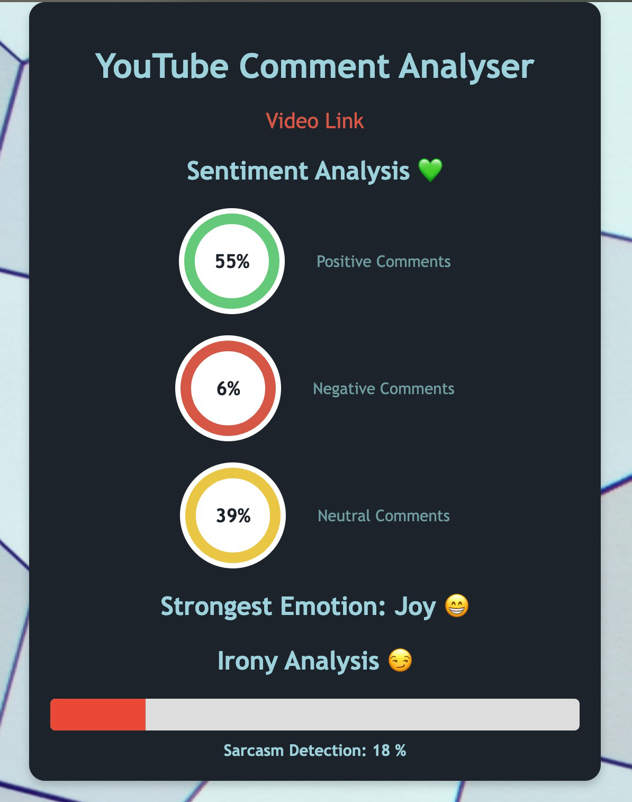
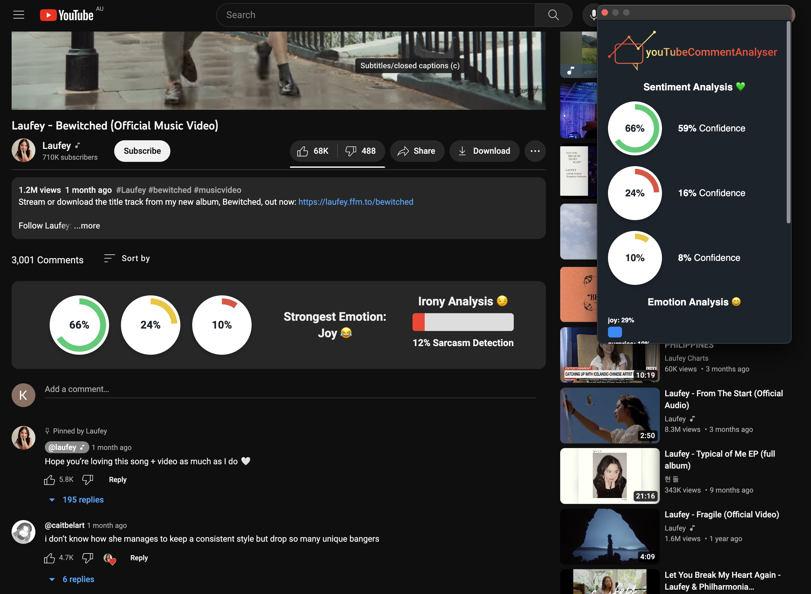

# MACathon 2023 Project Submission

youTubeCommentAnalyser is an extension/website that parses through the comments of a YouTube video, and utilises Natural Language Processing (NLP) to apply sentiment analysis and offer a reliable summary of the thoughts and feelings of the viewers. Three distinct machine learning models are applied to the comments data, providing insightful information about the amount of positive, neutral and negative comments, percentage of comments that fit a particular mood, and percentage of comments that are sarcastic.



## How to Run

### Website

1. Visit our [website](http://158.179.17.136:8080)
2. Paste in a valid YouTube URL to a specific video
3. Get the sentiment analysis of the comments, with the link to the video!

### Extension

1. Download and open ZIP of GitHub, or alternatively, run `git clone https://github.com/Kevin-Duignan/MACathon-noname`
1. Open a Chrome or Chromium
1. Visit your browser's [extensions](chrome://extensions/) page
1. Turn on Developer Mode
1. Load Unpacked
1. Select the _extension_ folder in this project's directory
1. You're done! Now visit any YouTube video
1. See the comment analysis above the comment section, and on the extension popup!

If you need more help, or are a FireFox user, visit this [video](https://www.youtube.com/watch?v=dhaGRJvJAII) for a thorough walkthrough.



### Running Server Locally

```
$ git clone https://github.com/Kevin-Duignan/MACathon-noname
$ cd MACathon-noname
$ pip install -r requirements.txt
$ uvicorn server:app
```

The server will download and optimise all NLP models on first boot. This will take some time and extra disk space (~2GB).

## Contributors

Kevin (Nguyen) Duignan

Daniel Arnould

Anthony Wilson
